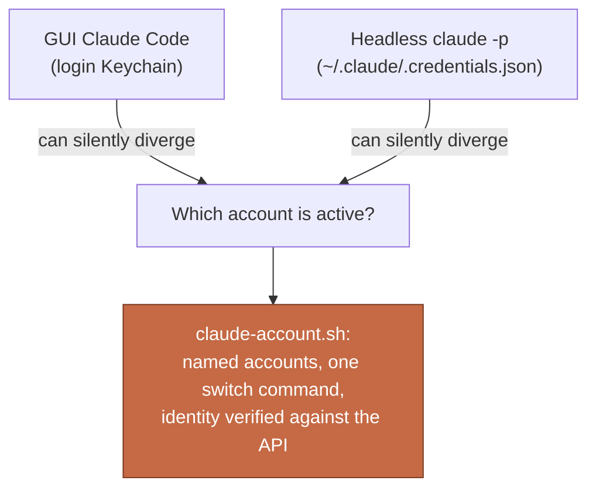

English | [中文](README.zh-CN.md)

# claude-code-switch-account

One shell script that switches your Claude Code CLI between multiple accounts, and shows every account's usage pool in one line.

**One Max account is not enough anymore. So now what: ration your prompts, chunk your work around the reset clock, put up with logging out and back in? None of that.** Switching is one word, your conversation survives it, and you can see every pool's level before you pick.

[](LICENSE)
[](https://docs.claude.com/en/docs/claude-code)
[](#)

> [!IMPORTANT]
> **Switching accounts does not cost you your conversation.** Your context lives in the session, not in the login. Two smooth paths:
>
> - **Mid-session:** run `/login` inside Claude Code and sign into the other account. The conversation keeps going where it was.
> - **With this script:** switch (`ccjane1`), then start `claude --continue` (or `claude --resume`) to pick the conversation back up on the new account.
>
> The classic use: your 5-hour pool runs dry mid-task, you switch to the other account, and keep working in the same conversation.

## The problem

Claude Code on macOS stores your login in two independent places, and they can disagree:

- **GUI sessions** read the login Keychain (`Claude Code-credentials`)
- **Headless processes** (cron jobs, SSH sessions, scripts calling `claude -p`) read a plaintext file, `~/.claude/.credentials.json`, because the Keychain is locked for non-GUI processes

Nothing keeps the two in sync. You can be logged into account A in your terminal while a nightly script quietly burns account B's weekly pool. We found this the hard way: a scheduled job scored ~80 job descriptions a day against an account nobody was watching, until that account's 7-day limit hit 100% and every call started failing.

`claude auth status` will not catch it. It prints a locally cached identity, not who the token really is. The only trustworthy answer comes from asking the API, which is what this tool does after every switch.



## What it does

- **`save <name>`** captures the currently logged-in account into `~/.claude/accounts/<name>.json` (owner-only permissions)
- **`use <name>`** switches this Mac to a saved account: writes the Keychain, syncs the headless file if present, then asks the API "who am I actually?" and prints the verified email
- **`usage <name>|all`** prints each saved account's 5-hour and 7-day pool utilization, read from the API's own rate-limit headers

```
$ claude-account.sh usage all
  jane1:  5h 58% (resets 07-23 12:50)   7d 39% (resets 07-29 14:00)
  jane2:  5h 3% (resets 07-23 13:05)   7d 88% (resets 07-24 17:00)
```

What it deliberately leaves out: no daemon, no config file, no dependencies beyond `bash`, `python3`, `curl`, and the macOS `security` CLI, all of which ship with the OS.

## Setup

> [!NOTE]
> This README is for you; the how-to below is enough for your coding agent too. Clone the repo, open it in Claude Code, and say what you want.

1. Take stock of your accounts first. List every Claude account you have, and give each a short name. You will use these names in every step below, so write the mapping down:

   | Name | Account |
   |---|---|
   | `jane1` | jane.doe@gmail.com |
   | `jane2` | jane.doe@outlook.com |

   (`jane1` and `jane2` are examples; name yours whatever you like.)

2. Put `claude-account.sh` anywhere (say `~/bin/`) and make it executable:

   ```bash
   chmod +x ~/bin/claude-account.sh
   ```

3. Add the aliases to `~/.zshrc` (one `use` alias per account name from step 1), then `source ~/.zshrc`:

   ```bash
   alias ccjane1="bash ~/bin/claude-account.sh use jane1"
   alias ccjane2="bash ~/bin/claude-account.sh use jane2"
   alias ccusage="bash ~/bin/claude-account.sh usage all"
   alias ccsave="bash ~/bin/claude-account.sh save"
   ```

4. Register each account once. Two actions, in order:

   1. In Claude Code, run `/login` and sign into the account
   2. In a regular terminal window, save it under its name: `ccsave jane1`

   Repeat for each account. From then on, switching is one word: `ccjane1`.

## Things worth knowing

> [!TIP]
> The `usage` command costs one token. There is no free public usage endpoint, so it sends a 1-token haiku request and reads the rate-limit headers off the response. On an account whose pool is already exhausted, the probe is rejected for free and still reports correctly.

- **Already-running Claude Code sessions keep their old login.** A switch applies to sessions started after it.
- **`save` must run in a GUI terminal** (Terminal.app or iTerm on the machine itself). Over plain SSH the Keychain is locked and the read fails, by design.
- **Parked credentials can go stale.** Claude auto-refreshes the account you actively use; one untouched for weeks may expire. Symptom: the switch prints a warning, or `claude` asks you to log in. Fix: `/login` that account once, then `save` it again.

> [!WARNING]
> Saved credentials in `~/.claude/accounts/` are the same secrets Claude Code itself stores. The script creates them with owner-only permissions; treat the folder like `~/.ssh` and never commit it anywhere.

## License

MIT. See [LICENSE](LICENSE).
