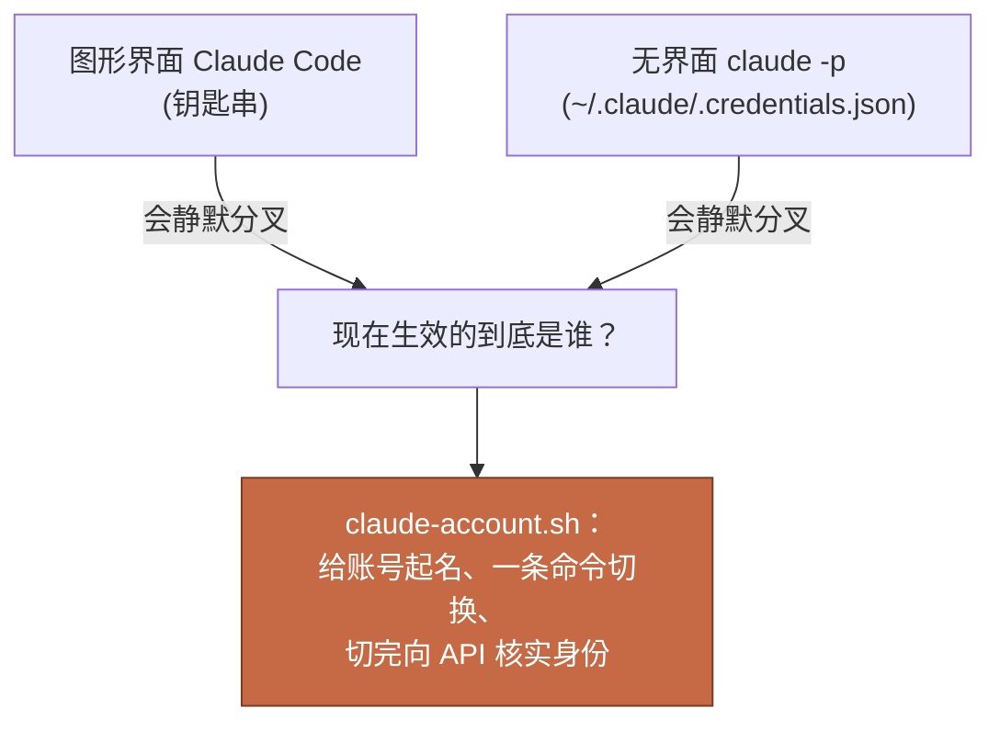

[English](README.md) | 中文

# claude-code-switch-account

一个 shell 脚本，让 Claude Code CLI 在多个账号之间一键切换，并且一行看完每个账号的用量。

**一个 Max 账号已经不够用了。那怎么办：省着用、掐着重置时间把工作切成小块、忍受反复登出登入？都不用。** 切换就是一个词，对话原地存活，而且切之前能先看清每个池子还剩多少。

[](LICENSE)
[](https://docs.claude.com/en/docs/claude-code)
[](#)

> [!IMPORTANT]
> **切换账号不会丢掉你的对话。** 上下文存在 session 里，不在登录态里。两条顺滑的路：
>
> - **会话中切**：在 Claude Code 里直接 `/login` 登录另一个账号，对话原地继续。
> - **用本脚本切**：先切（`ccjane1`），再用 `claude --continue`（或 `claude --resume`）接着上一个对话继续干。
>
> 最典型的用法：干活干到一半 5 小时池用完了，切到另一个账号，同一个对话接着写。

## 问题在哪

macOS 上的 Claude Code 把登录凭证存在两个互不知晓的地方：

- **图形界面的会话**读钥匙串（Keychain，条目名 `Claude Code-credentials`）
- **无界面进程**（cron 任务、SSH 会话、脚本里的 `claude -p`）读一个明文文件 `~/.claude/.credentials.json`。原因是非图形进程打不开钥匙串

没有任何机制保证两边一致。你可以在终端里登着账号 A，同时一个定时任务在安静地烧账号 B 的每周额度。这个工具就是这么被逼出来的：一个每天给 80 个 JD 打分的定时任务，烧的是一个没人盯着的账号，直到它的 7 天池到了 100%，所有调用开始集体失败。

`claude auth status` 查不出这种错位。它打印的是本地缓存的身份，不是 token 的真实身份。唯一可信的答案是直接问 API "我是谁"，这正是这个脚本每次切换后做的事。



## 它做什么

- **`save <名字>`** 把当前登录的账号存进 `~/.claude/accounts/<名字>.json`（仅本人可读）
- **`use <名字>`** 把这台 Mac 切到某个已存账号：写钥匙串、同步无界面文件（如果存在）、然后问 API "我到底是谁" 并打印核实过的邮箱
- **`usage <名字>|all`** 打印每个已存账号的 5 小时池和 7 天池用量，数据直接读 API 响应头里的 rate-limit 字段

```
$ claude-account.sh usage all
  jane1:  5h 58% (resets 07-23 12:50)   7d 39% (resets 07-29 14:00)
  jane2:  5h 3% (resets 07-23 13:05)   7d 88% (resets 07-24 17:00)
```

刻意不做的：没有常驻进程，没有配置文件，除了系统自带的 `bash`、`python3`、`curl`、`security` 之外零依赖。

## 安装

> [!NOTE]
> 这份 README 是写给你看的；下面的步骤也足够你的 coding agent 直接照做。Clone 下来，在 Claude Code 里打开，说你想要什么就行。

1. 先盘点你的账号。把手上每个 Claude 账号列出来，各起一个短名字。后面每一步都会用到这套名字，建议先写下这张对照表：

   | 名字 | 账号 |
   |---|---|
   | `jane1` | jane.doe@gmail.com |
   | `jane2` | jane.doe@outlook.com |

   （`jane1`、`jane2` 是示例，名字随你起。）

2. 把 `claude-account.sh` 放到任何地方（比如 `~/bin/`），加执行权限：

   ```bash
   chmod +x ~/bin/claude-account.sh
   ```

3. 在 `~/.zshrc` 里加好 alias（第 1 步的每个名字一个 `use`），然后 `source ~/.zshrc`：

   ```bash
   alias ccjane1="bash ~/bin/claude-account.sh use jane1"
   alias ccjane2="bash ~/bin/claude-account.sh use jane2"
   alias ccusage="bash ~/bin/claude-account.sh usage all"
   alias ccsave="bash ~/bin/claude-account.sh save"
   ```

4. 每个账号注册一次。两个动作，按顺序：

   1. 在 Claude Code 里 `/login`，登录那个账号
   2. 在普通终端窗口里按它的名字存下：`ccsave jane1`

   每个账号重复一遍。之后切换就是一个词：`ccjane1`。

## 几个要点

> [!TIP]
> `usage` 查询要花 1 个 token。没有免费的公开用量接口，所以它发一个 1 token 的 haiku 请求，从响应头里读 rate-limit 数据。已经爆池的账号，请求会被免费拒掉，但照样能读出正确的用量。

- **已经开着的 Claude Code 会话保持原来的登录。** 切换只影响之后新开的会话。
- **`save` 必须在图形终端里跑**（机器本机的 Terminal.app 或 iTerm）。纯 SSH 里钥匙串是锁着的，读取会失败，这是系统设计如此。
- **闲置的凭证会过期。** claude 只给正在用的账号自动续期；几周没碰的那份可能失效。症状是切换时打印 warning，或者 `claude` 要你重新登录。解法：`/login` 那个账号一次，再 `save` 一遍。

> [!WARNING]
> `~/.claude/accounts/` 里存的就是 Claude Code 自己用的那份凭证。脚本创建时已设为仅本人可读；把这个文件夹当 `~/.ssh` 对待，永远不要 commit 到任何仓库。

## 开源许可

MIT，见 [LICENSE](LICENSE)。
